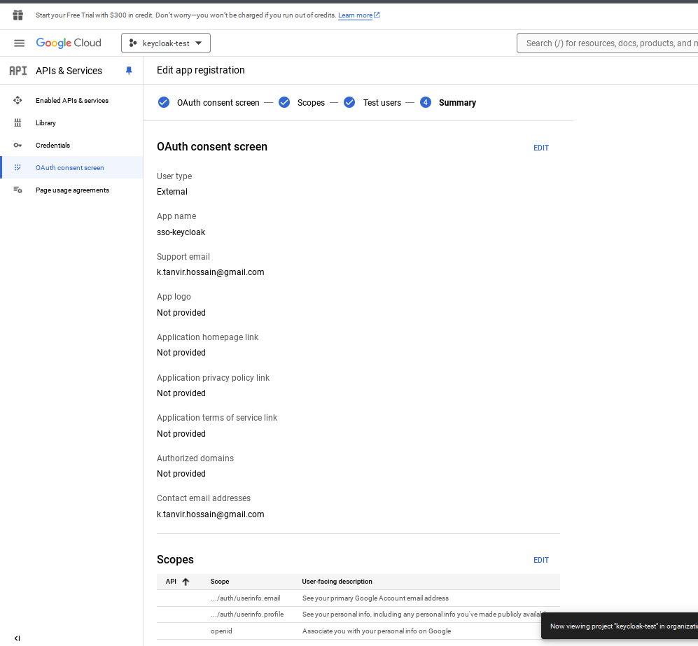
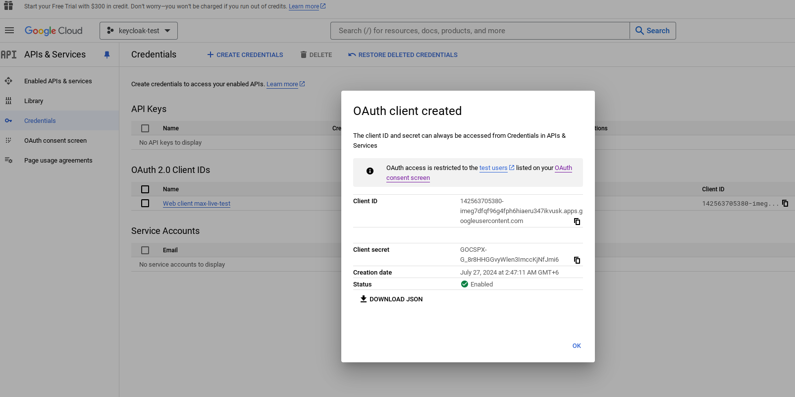
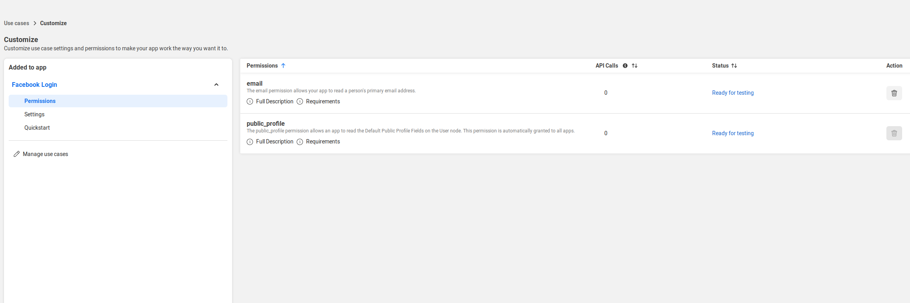
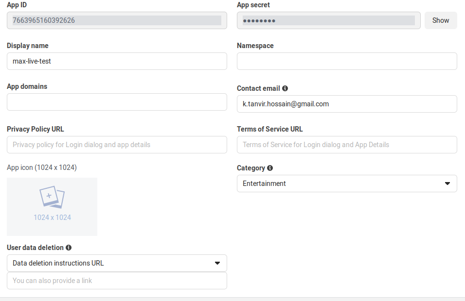
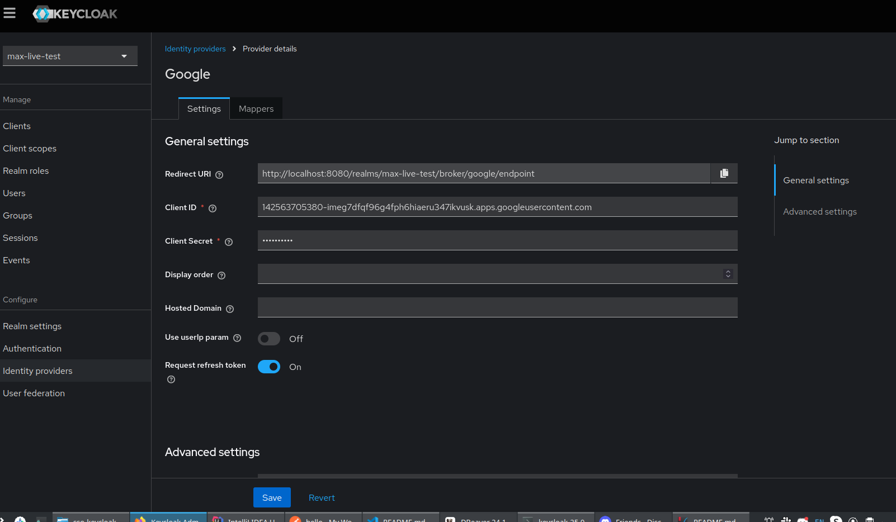
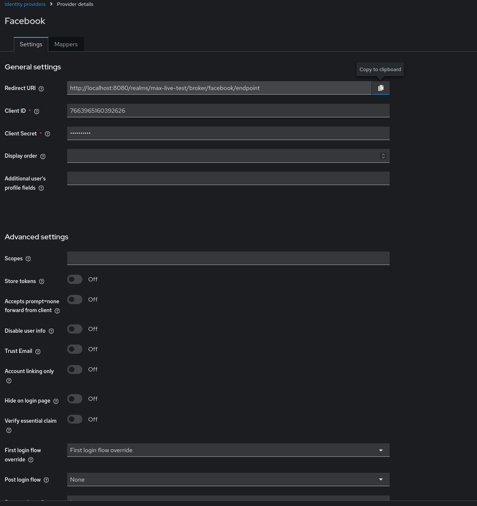
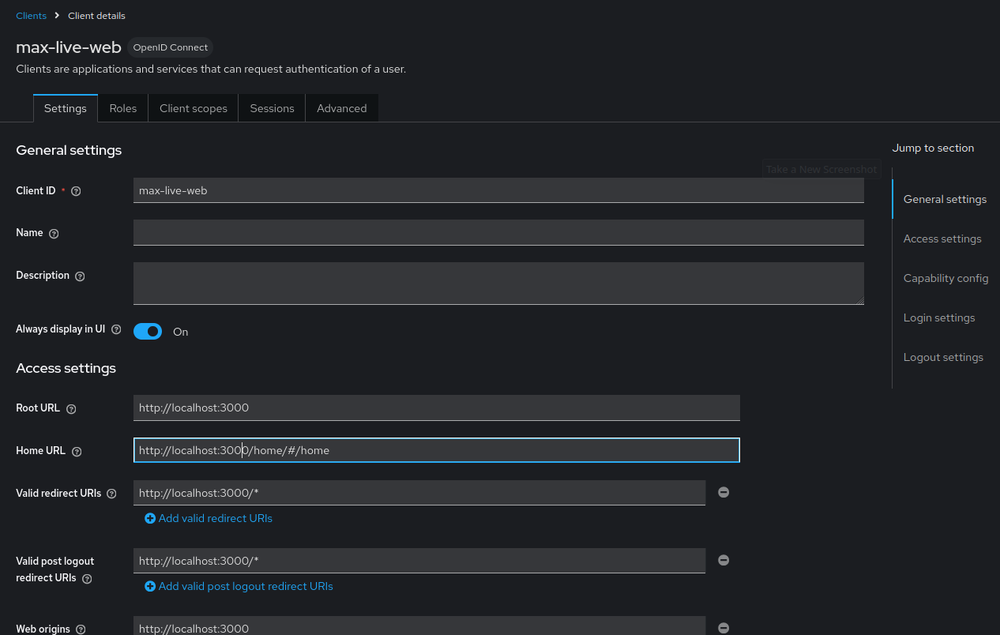
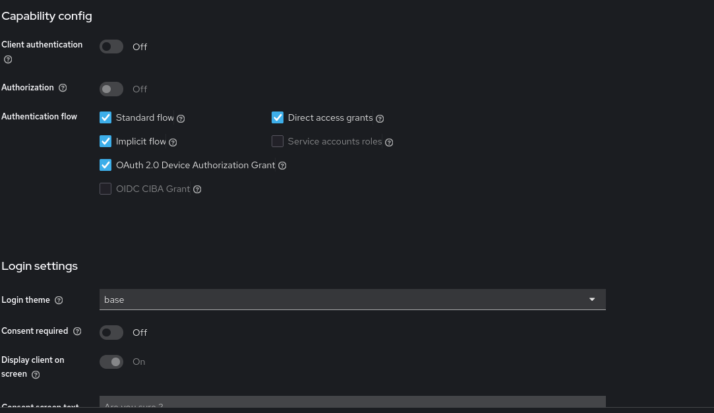
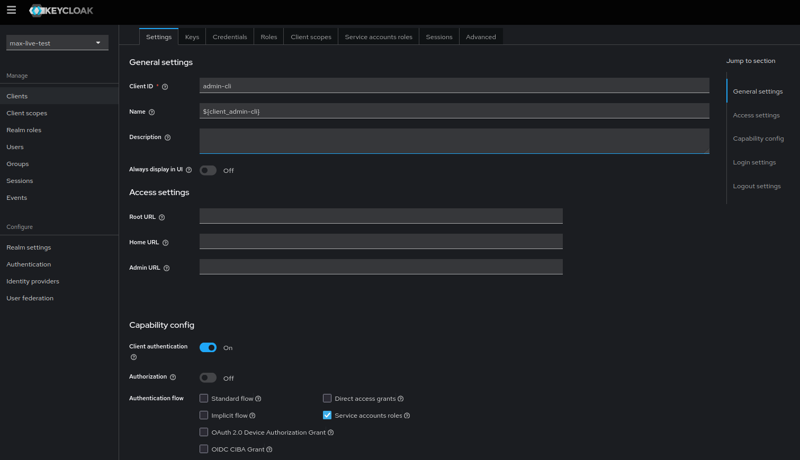
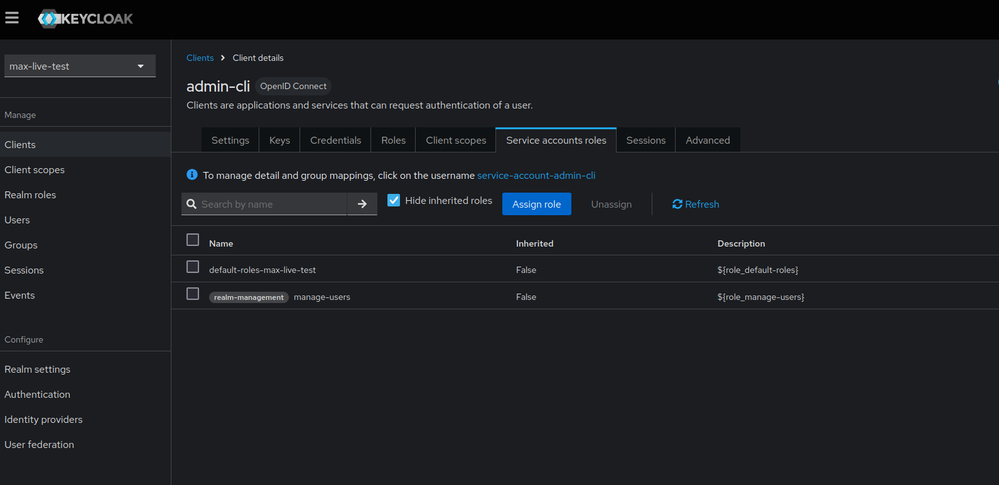

# SSO with Keycloak

This guide will walk you through the steps to configure Keycloak with PostgreSQL as the database and set up Single Sign-On (SSO) with Google and Facebook.

## Prerequisites

- PostgreSQL installed and running
- Keycloak downloaded and extracted from ZIP file
- Google and Facebook developer accounts

## Step 1: Set Up PostgreSQL

```sh
sudo -i -u postgres
psql
CREATE DATABASE keycloaktest;
CREATE USER developer WITH ENCRYPTED PASSWORD 'developer';
GRANT ALL PRIVILEGES ON DATABASE keycloaktest TO developer;
\q
```

## Step 2: Configure Keycloak

1. Start Keycloak with the following command:

    ```bash
    bin/kc.sh start-dev --db postgres --db-url jdbc:postgresql://localhost:5432/keycloaktest --db-username developer --db-password developer
    ```

2. Access Keycloak at http://localhost:8080 and log in with the admin credentials.

3. Create a new realm or use the default master realm.

4. Create a new client for your application.

## Step 3: Set Up Google Identity Provider

1. Go to the Google Developer Console and create a new project from this uri : https://console.cloud.google.com/apis/dashboard.
2. Navigate to the OAuth consent screen and configure it with ridirect uri : http://localhost:8080/realms/{realm-name}/broker/google/endpoint

3. Create OAuth 2.0 credentials and note the Client ID and Client Secret.


## Step 4: Set Up Facebook Identity Provider

1. Go to the Facebook Developer Console and create a new project from this uri : https://developers.facebook.com/apps.
2. Navigate to permissions and add email permissions.

3. Go to app settings and note the Client ID and Client Secret.


## Keycloak Google Identity Provider Configuration

1. In Keycloak, go to the Identity Providers tab and select Google.
2. Enter the Client ID and Client Secret from Google.
3. Set the Redirect URI to http://localhost:8080/realms/{realm-name}/broker/google/endpoint.
4. Client ID: Your Google Client ID
5. Client Secret: Your Google Client Secret


## Keycloak Facebook Identity Provider Configuration

1. In Keycloak, go to the Identity Providers tab and select Facebook.
2. Enter the Client ID and Client Secret from Facebook.
3. Set the Redirect URI to http://localhost:8080/realms/{realm-name}/broker/facebook/endpoint.
4. Client ID: Your Facebook Client ID
5. Client Secret: Your Facebook Client Secret


## Access your Keycloak account

http://localhost:8080/realms/{realm-name}/account/

## Simple React SPA with Keycloak Authentication

## Prerequisites

- Node.js (>= 12.x)
- npm (>= 6.x)
- Keycloak server (>= 10.x)

## Keycloak Setup

1. **Create a Client**:
   - In the newly created realm, navigate to the `Clients` section.
   - Click on `Create` and fill in the following details:
     - Client ID: `max-live-web`
     - Client Protocol: `openid-connect`
     - Root URL: `http://localhost:3000`
   - Save the client.

2. **Configure Client Settings**:
   - Set `Access Type` to `public`.
   - Set `Valid Redirect URIs` to `http://localhost:3000/*`.
   
   - Set `Web Origins` to `*`.
   - Set `client authentication` to `off`.
   

## React Setup

1. cd Simple-React-SPA
2. Install Dependencies

    ```sh
    npm install
    ```

3. Configure keycloak.js:

    ```javascript
    import Keycloak from 'keycloak-js';

    const keycloak = new Keycloak({
    url: 'http://localhost:8080/',
    realm: 'max-live-test',
    clientId: 'max-live-web'
    });

    export default keycloak;
    ```

4. Run the Application:

    ```sh
    npm start
    ```

5. Access the Application:
* Open your browser and navigate to http://localhost:3000

## Keycloak Integration in React

In your App.js file, initialize Keycloak and handle authentication:

```javascript
import React, { useState, useEffect } from 'react';
import Keycloak from 'keycloak-js';
import './App.css';

const keycloak = Keycloak('/keycloak.json');

function App() {
  const [keycloakInitialized, setKeycloakInitialized] = useState(false);
  const [authenticated, setAuthenticated] = useState(false);

  useEffect(() => {
    keycloak.init({ onLoad: 'login-required' }).then(authenticated => {
      setAuthenticated(authenticated);
      if (authenticated) {
        keycloak.updateToken(5).then(refreshed => {
          if (refreshed) {
            console.log('Token refreshed');
          } else {
            console.warn('Token not refreshed, valid for ' +
              Math.round(keycloak.tokenParsed.exp + keycloak.timeSkew - new Date().getTime() / 1000) + ' seconds');
          }
        }).catch(() => {
          console.error('Failed to refresh token');
          keycloak.logout();
        });
      } else {
        setAuthenticated(false);
      }
      setKeycloakInitialized(true);
    }).catch(() => {
      console.log('Failed to initialize Keycloak');
      setKeycloakInitialized(true); // Even if it fails, we set this to true to avoid infinite loading
    });
  }, []);

  const handleLogout = () => {
    keycloak.logout();
  };

  if (!keycloakInitialized) {
    return <div>Loading...</div>;
  }

  return (
    <div className="App">
      {authenticated ? (
        <div>
          <h1>Welcome to the App</h1>
          <button onClick={handleLogout}>Logout</button>
        </div>
      ) : (
        <div>Unable to authenticate!</div>
      )}
    </div>
  );
}

export default App;
```

Add a LogoutButton.js

```javascript
import React from 'react';
import keycloak from '../keycloak';

const LogoutButton = () => {
  const handleLogout = () => {
    keycloak.logout();
  };

  return (
    <button onClick={handleLogout}>Logout</button>
  );
};

export default LogoutButton;
```

## Create User with Keycloak Admin REST API

This guide will walk you through the steps to create a user in Keycloak using the Admin REST API.

### Prerequisites

- `admin-cli` client under the targeted realms configured with:
  - Client authentication enabled
  - Direct access grants enabled
  - Service accounts roles enabled
  
  - `manage-users` role assigned to the service account roles
  

### Steps

#### 1. Obtain an Access Token

First, you need to obtain an access token using the `admin-cli` client.

```sh
curl --location 'http://localhost:8080/realms/max-live-test/protocol/openid-connect/token' \
--header 'Content-Type: application/x-www-form-urlencoded' \
--data-urlencode 'grant_type=client_credentials' \
--data-urlencode 'client_id=admin-cli' \
--data-urlencode 'client_secret=<client_secret>'
```

Replace <client_secret> with the secret copied from the admin-cli client configuration.

#### 2. Create a User

Use the obtained access token to create a new user.

```bash
curl --location 'http://localhost:8080/admin/realms/max-live-test/users' \
--header 'Content-Type: application/json' \
--header 'Authorization: Bearer <access_token>' \
--data-raw '{
    "username": "newuser",
    "enabled": true,
    "firstName": "First",
    "lastName": "Last",
    "email": "newuser@example.com",
    "credentials": [
        {
            "type": "password",
            "value": "new_password",
            "temporary": false
        }
    ]
}'
```

Replace <access_token> with the token obtained in the previous step.

### Notes

* Ensure that the admin-cli client is properly configured under the max-live-test realm.
* The client_secret should be securely stored and not exposed in public repositories.
* The manage-users role must be assigned to the service account of the admin-cli client to allow user creation.

## Run keycloak with custom port and host

```bash
nohup bin/kc.sh start-dev --db postgres --db-url jdbc:postgresql://localhost:5432/keycloak --db-username developer --db-password developer --http-port=9999 --hostname https://domain.com --http-enabled true  &
```