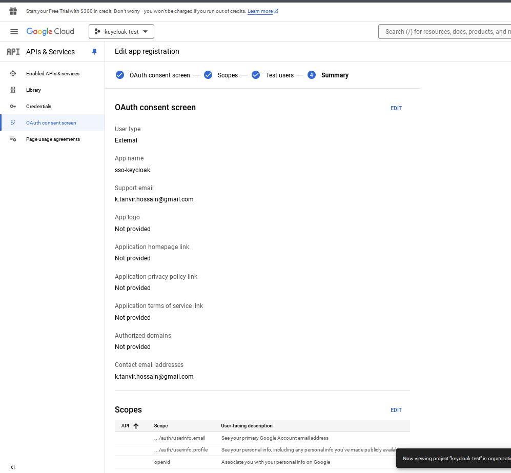
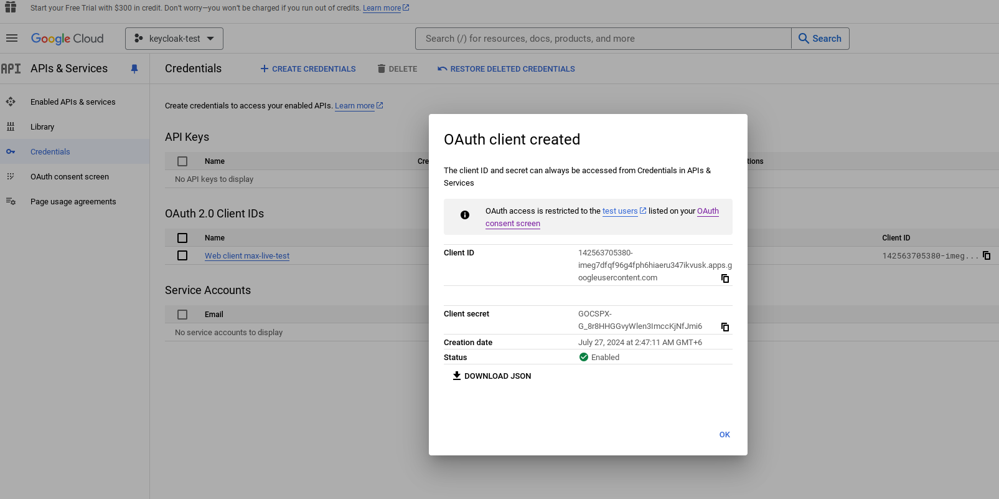
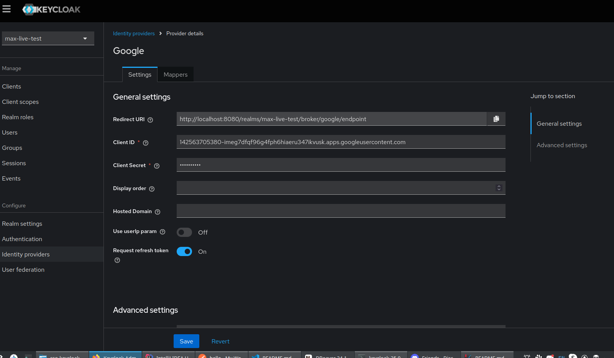

# SSO with Keycloak

This guide will walk you through the steps to configure Keycloak with PostgreSQL as the database and set up Single Sign-On (SSO) with Google and Facebook.

## Prerequisites

- PostgreSQL installed and running
- Keycloak downloaded and extracted from ZIP file
- Google and Facebook developer accounts

## Step 1: Set Up PostgreSQL

```sh
sudo -i -u postgres
psql
CREATE DATABASE keycloaktest;
CREATE USER developer WITH ENCRYPTED PASSWORD 'developer';
GRANT ALL PRIVILEGES ON DATABASE keycloaktest TO developer;
\q
```

## Step 2: Configure Keycloak

1. Start Keycloak with the following command:

    ```bash
    bin/kc.sh start-dev --db postgres --db-url jdbc:postgresql://localhost:5432/keycloaktest --db-username developer --db-password developer
    ```

2. Access Keycloak at http://localhost:8080 and log in with the admin credentials.

3. Create a new realm or use the default master realm.

4. Create a new client for your application.

## Step 3: Set Up Google Identity Provider

1. Go to the Google Developer Console and create a new project from this uri : https://console.cloud.google.com/apis/dashboard.
2. Navigate to the OAuth consent screen and configure it with ridirect uri : http://localhost:8080/realms/{realm-name}/broker/google/endpoint

3. Create OAuth 2.0 credentials and note the Client ID and Client Secret.


## Keycloak Identity Provider Configuration

1. In Keycloak, go to the Identity Providers tab and select Google.
2. Enter the Client ID and Client Secret from Google.
3. Set the Redirect URI to http://localhost:8080/realms/{realm-name}/broker/google/endpoint.
4. Client ID: Your Google Client ID
5. Client Secret: Your Google Client Secret


## Access your Keycloak account

http://localhost:8080/realms/{realm-name}/account/